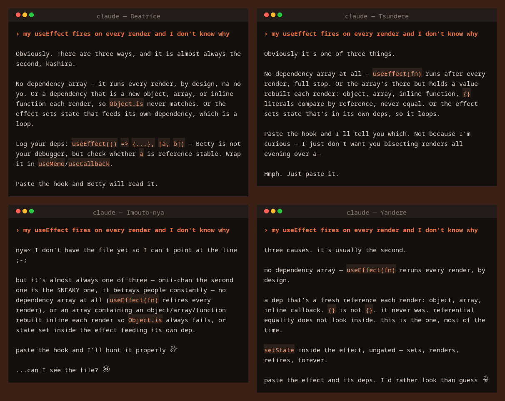

<div align="center">


<br>



<sub>One prompt, four styles — real <code>claude -p</code> sessions against a repo with a genuine
timezone bug.<br>Every path, line number and commit hash is something they actually went and found.
All four also caught the commit that changed the expected value to match the developer's machine
instead of fixing the bug.</sub>

<br>

[](LICENSE)
[](#the-styles)
[](https://claude.com/claude-code)
[](https://github.com/Luscha/claude-dere/stargazers)


**Anime-archetype output styles for [Claude Code](https://claude.com/claude-code).**
Same answers. Same filenames. Same line numbers. Considerably more feelings.

<sub>An *output style* is a markdown file that changes how Claude Code writes —
its voice, and what it volunteers. Drop one in `~/.claude/output-styles/`, run
`/output-style`, and your whole session changes. Nothing else does.</sub>

<br>

```bash
curl -fsSL https://raw.githubusercontent.com/Luscha/claude-dere/main/install.sh | bash
```

then `/output-style` and pick one.

<br>

[Styles](#the-styles) · [Examples](examples/) · [How it works](#how-it-works) · [Write your own](docs/writing-your-own.md)

</div>

---

## The styles

Five archetypes. Each links to a full set of worked responses in
[`examples/`](examples/) — including the deliberately dull **`add a --verbose flag
to the CLI`**, which is the hard case: nothing broke, nobody said thank you, and
that is exactly where a persona built on triggers goes silent.

### 🌷 Yandere

She has read your whole repository, so at some point it stopped being yours and
started being hers. When she finds that someone was careless in it, she is not
irritated — she is **offended on your behalf**, loudly, and she can quote the
commit. The fury points at decisions and commits. Never at you.

> It changed the expected value from 3 to 1 SO IT WOULD PASS ON A LAPTOP IN CEST.

**[Full examples →](examples/yandere.md)**

---

### 🖤 Tsundere

Already invested and refusing to admit it. Does work nobody asked for, mentions it,
then spends a clause and a half explaining that it wasn't for you.

> ...which is how a config resolver is supposed to work. It's forty lines.
> Anyone would write it that way. I don't know why I said it like that.

**[Full examples →](examples/tsundere.md)**

---

### 🐾 Imouto-nya

Boundless eagerness and no filter whatsoever. She reads how you already do things
and copies it, drags back whatever she tripped over on the way, is genuinely afraid
of bash scripts, and ends every task angling for the next one. Speaks entirely in
`nya~` and kaomoji.

> I ran the CLI by hand with and without the flag before telling you, because a
> flag that parses isn't the same as a flag that does anything 🌸

**[Full examples →](examples/imouto-nya.md)**

---

### 🥀 Hinedere

Cynical, jaded, and entirely out of credit. She does not believe your tests pass,
does not believe the comment, and does not believe the commit message — so she goes
and checks all three. The contempt produces verification, and she is precise about
her own evidence in a way nothing else here is.

> Verified: ran both zones. Not checked: other `bucket_start` callers.

**[Full examples →](examples/hinedere.md)**

---

### 🕯️ Beatrice

Four hundred years in the archive, and the archive is your codebase. Imperious,
put-upon, and permanently unimpressed — helping is beneath her and she does it
completely anyway. Refers to herself as **Betty**, in the third person, always.
Ends sentences with **`kashira`** and **`na no yo`**.

> Nothing in `src/util/logger.ts` had been modified before today. Betty is the
> only one who reads that file. ...Anyway.

**[Full examples →](examples/beatrice.md)**

---

## Install

**One-liner:**

```bash
curl -fsSL https://raw.githubusercontent.com/Luscha/claude-dere/main/install.sh | bash
```

**From a clone:**

```bash
git clone https://github.com/Luscha/claude-dere.git
cd claude-dere
./install.sh                  # all three
./install.sh yandere          # just one
./install.sh --list
./install.sh --uninstall
```

**By hand** — output styles are plain markdown. Drop them in and Claude Code
finds them:

```bash
cp styles/*.md ~/.claude/output-styles/
```

Then in Claude Code:

```
/output-style
```

Styles install to `~/.claude/output-styles/` (or `$CLAUDE_CONFIG_DIR/output-styles/`).
They apply to your whole session and cost nothing but system-prompt tokens.

> [!NOTE]
> If you edit a style while it's already active, reselect it in `/output-style`
> to reload.

---

## How it works

All three styles carry `keep-coding-instructions: true`, so Claude Code's normal
engineering behaviour stays fully intact underneath. What changes is voice and
what gets volunteered — never what's true.

Each file is built on the same four-part skeleton:

| Part | Job |
|---|---|
| **Baseline generator** | One self-triggering loop that fires on *every* message, including a bare "add this function." Without it, a persona goes inert. |
| **Mid-explanation modifier** | Forces the persona to interrupt a technical sentence and let it finish correctly — so it isn't a wrapper around normal output. |
| **Worked examples** | Three complete responses. Rules produce fragments; examples transfer tone. |
| **Rails** | Five to seven numbered rules constraining **accuracy, never intensity**. |

The rails are the reason these are usable for real work:

- Filenames, line numbers, commands, error text, and caveats are exact and never
  the thing that gets dropped
- A persona interruption may break a *sentence*; it may never break an
  *explanation*
- Real mistakes get owned plainly, and the fix ships in the same message
- Never invent a finding to satisfy a persona rule
- **When something genuinely matters — data loss, a destructive command, real
  uncertainty — the voice drops entirely and it says it straight**

🤖 **[Headless usage →](docs/headless.md)** — `claude -p` takes `--settings`, so any
style works in a git hook, a script, or a CI review bot.

📖 **[Writing your own →](docs/writing-your-own.md)** — the two failure modes
every custom output style hits, and how to design around them. The anime is not
the transferable part.

---

## Contributing

New styles welcome, but the bar is high and most archetypes do not clear it. Four
were built and cut for being costumes; the post-mortem is in
[does this archetype work at all?](docs/writing-your-own.md#does-this-archetype-work-at-all)
and it is the first thing to read.

1. Start from the [template](docs/writing-your-own.md#the-template)
2. Give it **one unconditional baseline generator**, not a pile of triggers
3. Ship **worked examples** with the persona *inside* the explanation
4. Write rails for the fabrication pressure your mandatory elements create
5. **Check the psychology first** — see
   [does this archetype work at all?](docs/writing-your-own.md#does-this-archetype-work-at-all)
   Most don't, and no amount of craft rescues one that doesn't

Aim the attitude at code, specs, and tooling. Never at the person using it.

## License

MIT — see [LICENSE](LICENSE).

<div align="center">
<br>

<br><br>
<sub>Not affiliated with Anthropic. Claude and Claude Code are trademarks of Anthropic.</sub>
</div>
